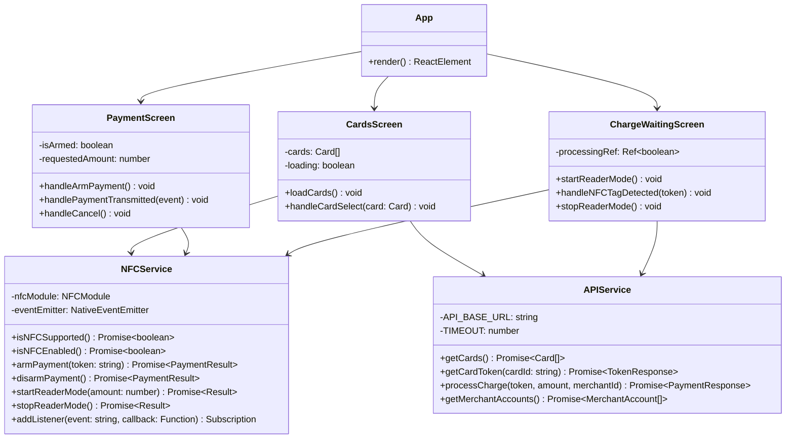
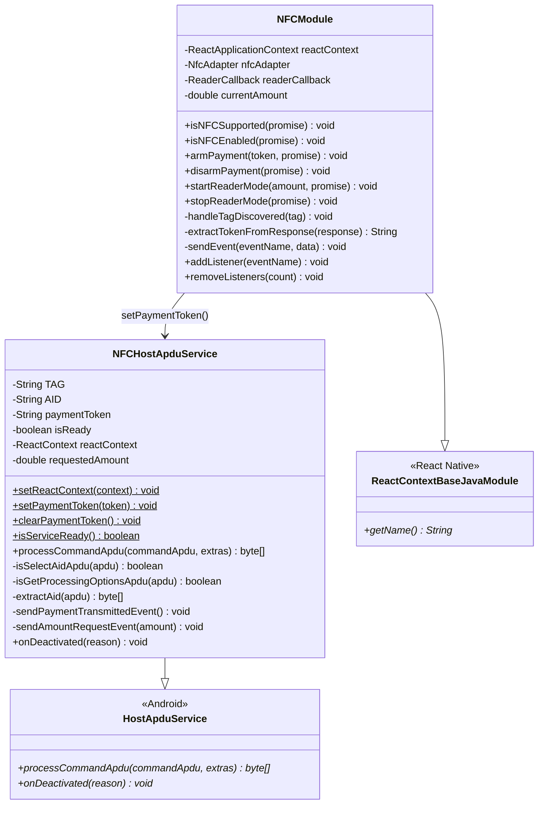
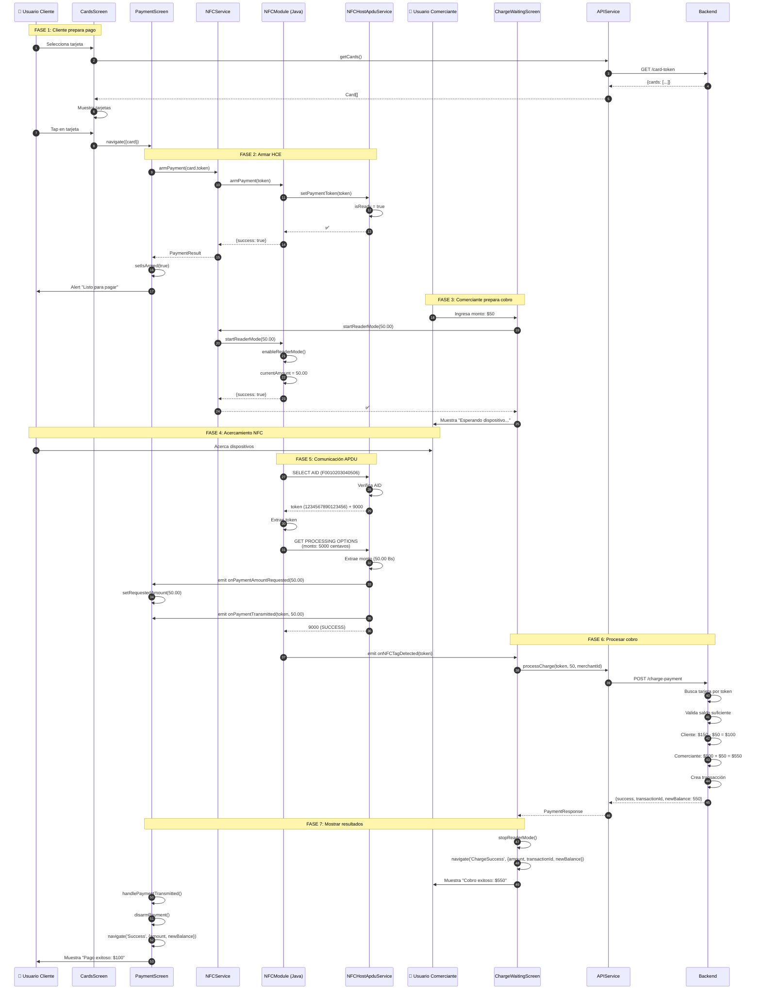
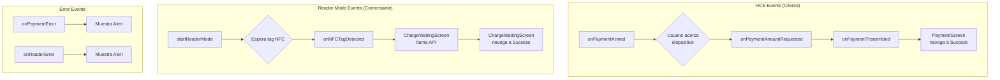
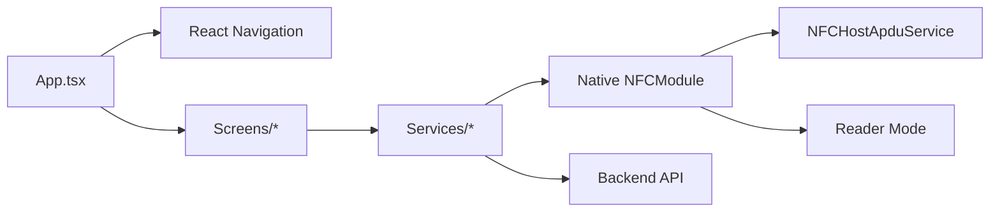
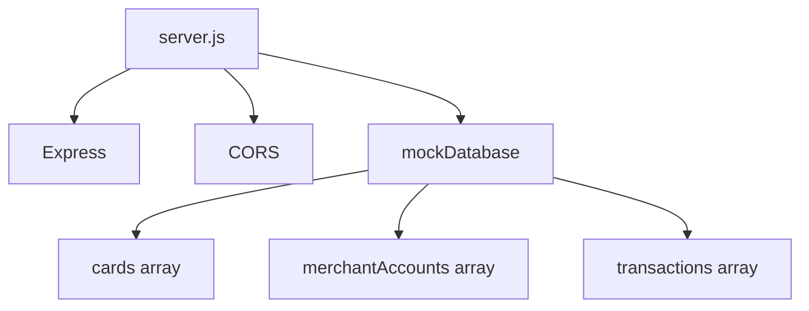
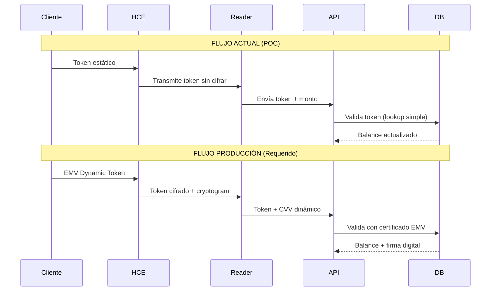

# 📐 ARQUITECTURA TÉCNICA COMPLETA - POC NFC

Este documento contiene los diagramas técnicos detallados de la arquitectura del sistema.

## 📑 Índice

1. [Diagrama de Clases](#diagrama-de-clases)
2. [Diagrama de Secuencia Completo](#diagrama-de-secuencia-completo)
3. [Arquitectura de Datos](#arquitectura-de-datos)
4. [Flujo de Eventos](#flujo-de-eventos)
5. [Estructura de Archivos](#estructura-de-archivos)

---

## 🎯 Diagrama de Clases

### Frontend (TypeScript)



### Backend (Java)



---

## 🔄 Diagrama de Secuencia Completo

### Flujo End-to-End con Todos los Componentes



---

## 💾 Arquitectura de Datos

### Modelos de Datos

```typescript
// FRONTEND TYPES

interface Card {
  id: string                    // "1"
  cardNumber: string            // "4532015112830366"
  lastFourDigits: string        // "0366"
  token: string                 // "1234567890123456"
  balance: number               // 15000.00
  cardHolder: string            // "Juan Pérez"
  expiryDate: string            // "12/28"
  cardType: string              // "Débito" | "Crédito"
}

interface MerchantAccount {
  id: string                    // "m1"
  accountNumber: string         // "1234567890"
  accountType: string           // "Ahorros" | "Corriente" | "Nómina"
  balance: number               // 50000.00
  accountHolder: string         // "Comercio GanaMóvil"
  bankName: string              // "Banco GanaMóvil"
}

interface Transaction {
  id: string                    // "txn_1234567890"
  amount: number                // 50.00
  newBalance: number            // 100.00
  timestamp: string             // "2026-02-02T10:30:00Z"
}

interface PaymentResponse {
  success: boolean              // true
  message: string               // "Pago procesado"
  transaction?: Transaction
  transactionId?: string
  newBalance?: number
  error?: string
}
```

### Base de Datos Mock (Backend)

```javascript
mockDatabase = {
  // TARJETAS CLIENTE (Modo Pagar)
  cards: [
    {
      id: '1',
      cardNumber: '4532015112830366',
      token: '1234567890123456',
      balance: 15000.00,
      cardHolder: 'Juan Pérez',
      expiryDate: '12/28',
      cardType: 'Débito'
    },
    {
      id: '2',
      cardNumber: '5425233430109903',
      token: '6543210987654321',
      balance: 8500.50,
      cardHolder: 'Juan Pérez',
      expiryDate: '06/27',
      cardType: 'Crédito'
    }
  ],
  
  // CUENTAS COMERCIANTE (Modo Cobrar)
  merchantAccounts: [
    {
      id: 'm1',
      accountNumber: '1234567890',
      accountType: 'Ahorros',
      balance: 50000.00,
      accountHolder: 'Comercio GanaMóvil',
      bankName: 'Banco GanaMóvil'
    },
    {
      id: 'm2',
      accountNumber: '0987654321',
      accountType: 'Corriente',
      balance: 125000.00,
      accountHolder: 'Comercio GanaMóvil',
      bankName: 'Banco GanaMóvil'
    },
    {
      id: 'm3',
      accountNumber: '5555666677',
      accountType: 'Nómina',
      balance: 35000.00,
      accountHolder: 'Comercio GanaMóvil',
      bankName: 'Banco Popular'
    }
  ],
  
  // HISTORIAL DE TRANSACCIONES
  transactions: [
    // Se agregan dinámicamente al procesar pagos
  ]
}
```

---

## 📡 Flujo de Eventos

### Eventos NFC (NativeEventEmitter)



### Tabla de Eventos

| Evento | Emisor | Receptor | Datos | Propósito |
|--------|--------|----------|-------|-----------|
| **onPaymentArmed** | NFCModule | PaymentScreen | `{success, message, token}` | Confirma que HCE está listo |
| **onPaymentAmountRequested** | NFCHostApduService | PaymentScreen | `{amount}` | Informa monto solicitado por terminal |
| **onPaymentTransmitted** | NFCHostApduService | PaymentScreen | `{token, amount}` | Confirma transmisión NFC exitosa |
| **onPaymentDisarmed** | NFCModule | PaymentScreen | `{success, message}` | Confirma desactivación de HCE |
| **onNFCTagDetected** | NFCModule | ChargeWaitingScreen | `{token, amount, success}` | Informa token leído del cliente |
| **onReaderError** | NFCModule | ChargeWaitingScreen | `{error}` | Notifica error en Reader Mode |

---

## 📁 Estructura de Archivos

### Estructura Completa del Proyecto

```
POCNFC/
│
├── android/                                    # Proyecto Android nativo
│   ├── app/
│   │   ├── src/
│   │   │   └── main/
│   │   │       ├── java/com/pocnfc/
│   │   │       │   ├── MainActivity.java       # Actividad principal RN
│   │   │       │   ├── MainApplication.java    # App Android + RN setup
│   │   │       │   ├── NFCHostApduService.java ⭐ # Servicio HCE (CORE)
│   │   │       │   └── NFCModule.java          ⭐ # Bridge React Native
│   │   │       │
│   │   │       ├── res/
│   │   │       │   ├── xml/
│   │   │       │   │   └── apduservice.xml     # Config HCE + AID
│   │   │       │   └── values/
│   │   │       │       └── strings.xml
│   │   │       │
│   │   │       └── AndroidManifest.xml         # Permisos NFC + HCE service
│   │   │
│   │   └── build.gradle                         # Config Gradle app
│   │
│   ├── build.gradle                             # Config Gradle root
│   └── gradle.properties                        # Props Gradle
│
├── backend/                                     # Backend Mock (Node.js)
│   ├── server.js                                # Servidor Express
│   ├── package.json                             # Dependencias backend
│   └── README.md                                # Docs backend
│
├── src/                                         # Código fuente React Native
│   ├── screens/                                 # Pantallas de navegación
│   │   ├── CardsScreen.tsx                      ⭐ # Selección de tarjeta
│   │   ├── PaymentScreen.tsx                    ⭐ # Pantalla HCE (CORE)
│   │   ├── SuccessScreen.tsx                    # Confirmación cliente
│   │   ├── AccountSelectionScreen.tsx           # Selección cuenta comerciante
│   │   ├── ChargeHomeScreen.tsx                 # Ingreso de monto
│   │   ├── ChargeWaitingScreen.tsx              # Espera NFC (Reader Mode)
│   │   └── ChargeSuccessScreen.tsx              # Confirmación comerciante
│   │
│   ├── services/                                # Servicios compartidos
│   │   ├── NFCService.ts                        ⭐ # Bridge JS ↔ Native
│   │   └── APIService.ts                        # Cliente HTTP REST
│   │
│   ├── components/                              # Componentes reutilizables
│   │   └── NFCLogo.tsx                          # Logo NFC animado
│   │
│   └── types/                                   # Definiciones TypeScript
│       ├── navigation.ts                        # Tipos de navegación
│       └── nfc.ts                               # Tipos de NFC y API
│
├── App.tsx                                      # Root component (Navigation)
├── index.js                                     # Entry point React Native
├── package.json                                 # Dependencias proyecto
├── tsconfig.json                                # Config TypeScript
├── babel.config.js                              # Config Babel
├── metro.config.js                              # Config Metro bundler
│
├── README.md                                    ⭐ # Documentación principal
├── ARCHITECTURE.md                              ⭐ # Este archivo
├── HCE-VS-READER-MODE.md                        # Comparación técnica HCE
├── PAYMENT-FLOW-FIX.md                          # Fix del pago doble
└── AI-DEVELOPMENT-PROMPT.md                     # Guía para desarrollo AI
```

### Archivos Clave por Función

#### Host Card Emulation (HCE) - ⭐ CORE

```
NFCHostApduService.java         # Emula tarjeta NFC, responde APDUs
├── processCommandApdu()        # Maneja SELECT AID y GPO
├── isSelectAidApdu()          # Detecta comando SELECT
├── isGetProcessingOptionsApdu() # Detecta comando GPO
├── sendPaymentTransmittedEvent() # Notifica a React Native
└── sendAmountRequestEvent()   # Envía monto a React Native

apduservice.xml                 # Config del servicio HCE
└── <aid-filter>               # Registra AID: F0010203040506
```

#### React Native Bridge

```
NFCModule.java                  # Expone APIs nativas a JS
├── armPayment()               # Configura token en HCE
├── startReaderMode()          # Activa Reader Mode
├── handleTagDiscovered()      # Maneja detección NFC
└── addListener/removeListeners # NativeEventEmitter

NFCService.ts                   # Wrapper TypeScript
├── armPayment()               # Llama NFCModule
├── startReaderMode()          # Llama NFCModule
└── addListener()              # Suscribe a eventos
```

#### Pantallas Principales

```
PaymentScreen.tsx               # Pantalla HCE cliente
├── handleArmPayment()         # Prepara pago
├── handlePaymentTransmitted() # Maneja pago completado
└── useEffect()                # Suscribe a eventos NFC

ChargeWaitingScreen.tsx         # Pantalla Reader Mode
├── startReaderMode()          # Inicia lectura
├── handleNFCTagDetected()     # Procesa token leído
└── processCharge()            # Llama backend
```

---

## 🔍 Análisis de Dependencias

### Frontend Dependencies



### Backend Dependencies



---

## 🔐 Flujo de Seguridad (Simplificado)

**⚠️ ADVERTENCIA: Este es un POC educativo. NO usar en producción.**



### Mejoras de Seguridad Requeridas

| Componente | POC Actual | Producción Requerida |
|------------|------------|---------------------|
| **Token** | Estático (16 dígitos) | EMV Dynamic (cambia por transacción) |
| **Comunicación NFC** | Sin cifrar | TLS sobre NFC / AES-256 |
| **Autenticación** | Lookup simple | Certificados EMV + PKI |
| **Backend** | HTTP sin auth | HTTPS + OAuth 2.0 / JWT |
| **Base de datos** | In-memory | PostgreSQL + cifrado at-rest |
| **Cumplimiento** | Ninguno | PCI-DSS Level 1 |

---

## 📊 Métricas del Sistema

### Latencia Esperada

```
┌─────────────────────────────────────────────┐
│ FASE                     │ TIEMPO ESPERADO  │
├─────────────────────────────────────────────┤
│ Preparar HCE             │ ~100ms          │
│ Detección NFC            │ ~200-500ms      │
│ SELECT AID (APDU 1)      │ ~50ms           │
│ GET PROCESSING (APDU 2)  │ ~50ms           │
│ Llamada Backend          │ ~300-1000ms     │
│ Actualización UI         │ ~50ms           │
├─────────────────────────────────────────────┤
│ TOTAL (flujo completo)   │ ~750-1750ms     │
└─────────────────────────────────────────────┘
```

### Tamaño de Datos

```
┌────────────────────────────────────────┐
│ COMPONENTE       │ TAMAÑO             │
├────────────────────────────────────────┤
│ APDU SELECT AID  │ 13 bytes           │
│ APDU Response    │ 18 bytes (token+SW)│
│ APDU GPO         │ 10 bytes           │
│ API Request      │ ~200 bytes (JSON)  │
│ API Response     │ ~300 bytes (JSON)  │
└────────────────────────────────────────┘
```

---

## 🎓 Referencias Técnicas

### Estándares Implementados

- **ISO/IEC 7816**: Smart cards (APDU protocol)
- **ISO/IEC 14443**: Contactless cards (NFC Type A/B)
- **Android HCE**: Host Card Emulation API (Android 4.4+)
- **React Native**: Bridge Architecture

### Documentación Externa

- [Android HCE Guide](https://developer.android.com/guide/topics/connectivity/nfc/hce)
- [ISO 7816-4 APDU](https://www.iso.org/standard/54550.html)
- [EMV Specifications](https://www.emvco.com/specifications/)
- [React Native Bridge](https://reactnative.dev/docs/native-modules-android)

---

**Documento creado**: 2026-02-02  
**Versión**: 1.0.0  
**Autor**: Equipo GanaMóvil
