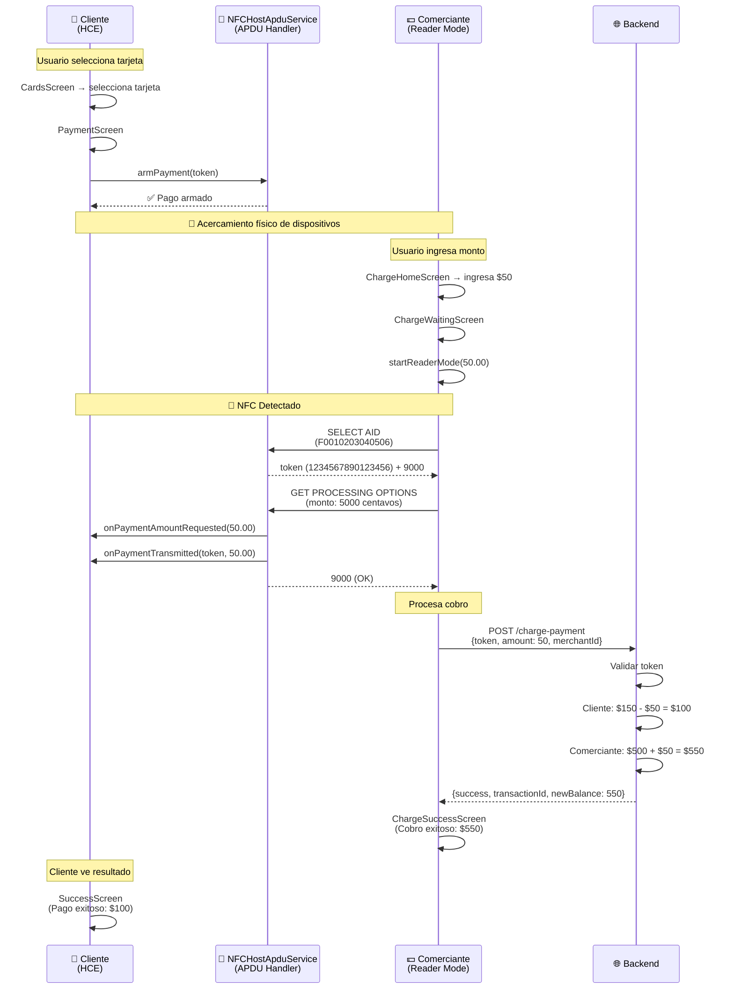
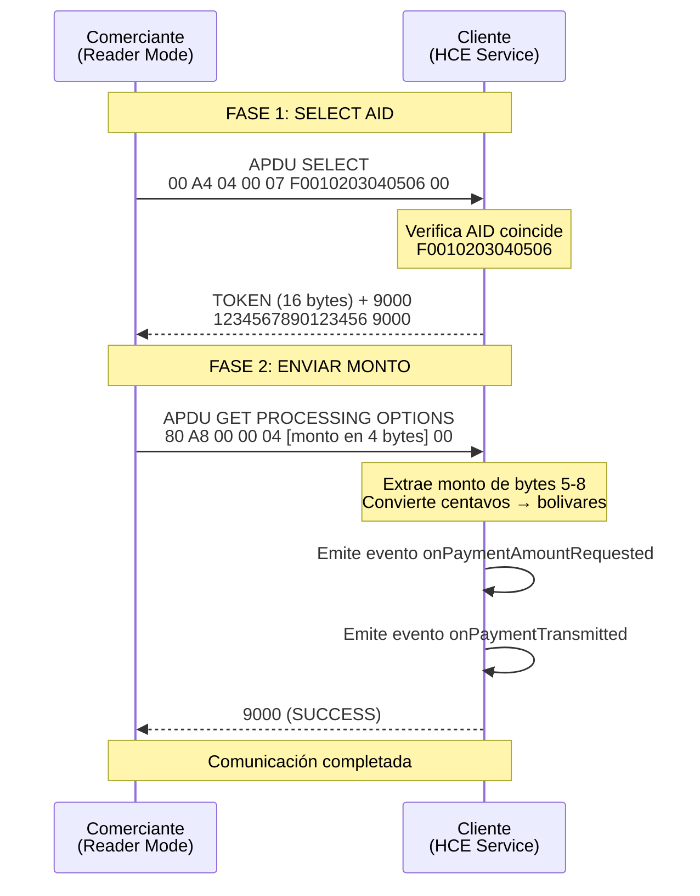

# 📱 POC NFC - GanaMóvil

**Prueba de Concepto de pagos NFC** usando **Host Card Emulation (HCE)** y **Reader Mode** para Android.

## 📋 Tabla de Contenidos

- [Inicio Rápido](#-inicio-rápido)
- [Arquitectura del Sistema](#-arquitectura-del-sistema)
- [Diagramas de Flujo](#-diagramas-de-flujo)
- [Protocolo APDU](#-protocolo-apdu)
- [Funcionalidades](#-funcionalidades)
- [Cómo Probar](#-cómo-probar)
- [Documentación Adicional](#-documentación-adicional)

---

## 🚀 Inicio Rápido

```bash
# Terminal 1: Backend Mock
cd backend
npm install
npm start

# Terminal 2: Aplicación React Native
npm install
npm run android
```

**Requisitos:**
- Node.js 20+
- Android Studio
- Dispositivo Android físico con NFC (el emulador NO soporta NFC)
- JDK 17+

---

## 🏗️ Arquitectura del Sistema

### Diagrama de Capas

```
┌──────────────────────────────────────────────────────────────┐
│                    REACT NATIVE APP                          │
│                     (TypeScript)                             │
├──────────────────────────────────────────────────────────────┤
│                                                              │
│  ┌────────────────────┐      ┌────────────────────┐        │
│  │   MODO PAGAR ⭐    │      │   MODO COBRAR      │        │
│  │  (Cliente/HCE)     │      │  (Comerciante)     │        │
│  └────────────────────┘      └────────────────────┘        │
│           │                            │                     │
│           ├── CardsScreen             ├── AccountSelection  │
│           ├── PaymentScreen           ├── ChargeHomeScreen  │
│           └── SuccessScreen           ├── ChargeWaiting     │
│                                       └── ChargeSuccess      │
│                                                              │
└──────────────────┬───────────────────────┬──────────────────┘
                   │                       │
                   ▼                       ▼
         ┌─────────────────┐     ┌─────────────────┐
         │   NFCService    │     │   APIService    │
         │  (TypeScript)   │     │  (TypeScript)   │
         └────────┬────────┘     └────────┬────────┘
                  │                       │
                  │                       │ HTTPS
                  ▼                       ▼
    ┌─────────────────────────────────────────────────┐
    │        NATIVE BRIDGE (Java)                     │
    ├─────────────────────────────────────────────────┤
    │                                                 │
    │  ┌──────────────────────┐  ┌────────────────┐ │
    │  │ NFCHostApduService ⭐│  │   NFCModule    │ │
    │  │   (HCE Service)      │  │ (RN Bridge)    │ │
    │  └──────────────────────┘  └────────────────┘ │
    │           │                        │           │
    │           │ APDU Protocol          │ IsoDep   │
    │           ▼                        ▼           │
    │     ┌──────────┐            ┌──────────┐      │
    │     │   HCE    │            │  Reader  │      │
    │     │  Emula   │            │   Mode   │      │
    │     │ Tarjeta  │            │   Lee    │      │
    │     └──────────┘            └──────────┘      │
    └─────────────────────────────────────────────────┘
                  │                       │
                  └───────────┬───────────┘
                              │ NFC
                              ▼
                    ┌──────────────────┐
                    │  COMUNICACIÓN    │
                    │  NFC FÍSICA      │
                    │  (13.56 MHz)     │
                    └──────────────────┘
                              ▲
                              │
                    ┌──────────────────┐
                    │   BACKEND MOCK   │
                    │    (Node.js)     │
                    │   Express + DB   │
                    │     In-Memory    │
                    └──────────────────┘
```

### Componentes Principales

#### 1. **Capa React Native** (Frontend)

| Componente | Propósito | Tipo |
|------------|-----------|------|
| **App.tsx** | Configuración de navegación (Tabs + Stacks) | Root |
| **CardsScreen** | Selección de tarjeta para pagar | HCE ⭐ |
| **PaymentScreen** | Activa HCE y espera NFC | HCE ⭐ |
| **SuccessScreen** | Confirmación de pago cliente | HCE ⭐ |
| **AccountSelectionScreen** | Selección de cuenta comerciante | Reader |
| **ChargeHomeScreen** | Ingreso de monto a cobrar | Reader |
| **ChargeWaitingScreen** | Espera NFC del cliente | Reader |
| **ChargeSuccessScreen** | Confirmación de cobro | Reader |

#### 2. **Capa de Servicios** (TypeScript)

| Servicio | Función | Métodos Clave |
|----------|---------|---------------|
| **NFCService** | Bridge con módulo nativo | `armPayment()`, `startReaderMode()`, `addListener()` |
| **APIService** | Cliente HTTP REST | `getCards()`, `processCharge()`, `authorizePayment()` |

#### 3. **Capa Nativa** (Java)

| Clase | Función | Responsabilidad |
|-------|---------|-----------------|
| **NFCHostApduService** ⭐ | Servicio HCE Android | Emula tarjeta NFC, responde APDUs |
| **NFCModule** | Bridge React Native | Expone APIs nativas a JavaScript |

#### 4. **Backend Mock** (Node.js)

| Endpoint | Método | Descripción |
|----------|--------|-------------|
| `/card-token` | GET | Lista de tarjetas disponibles |
| `/card-token/:id` | GET | Token de tarjeta específica |
| `/authorize-payment` | POST | Autoriza pago (cliente) |
| `/charge-payment` | POST | Procesa cobro (comerciante) |
| `/merchant-accounts` | GET | Cuentas de comerciante |

---

## 📊 Diagramas de Flujo

### 1. Flujo Completo: Pago NFC (HCE)



### 2. Flujo Detallado: Protocolo APDU



### 3. Arquitectura de Componentes por Módulos

```
┌─────────────────────────────────────────────────────────────┐
│                      APP PRINCIPAL                          │
│                         App.tsx                             │
└───────────────┬─────────────────────────────────────────────┘
                │
        ┌───────┴───────┐
        │               │
        ▼               ▼
┌───────────────┐   ┌───────────────┐
│   Tab: PAGAR  │   │  Tab: COBRAR  │
│   (PayMode)   │   │ (ChargeMode)  │
└───────┬───────┘   └───────┬───────┘
        │                   │
        │                   │
        ▼                   ▼
┌────────────────────────────────────────────┐
│         STACK NAVEGACIÓN PAGAR             │
├────────────────────────────────────────────┤
│  1. CardsScreen                            │
│     - Carga tarjetas desde API             │
│     - Muestra balance disponible           │
│     └─→ Navega a: PaymentScreen           │
│                                            │
│  2. PaymentScreen ⭐                       │
│     - Llama NFCService.armPayment(token)  │
│     - Escucha: onPaymentTransmitted       │
│     - Escucha: onPaymentAmountRequested   │
│     └─→ Navega a: SuccessScreen          │
│                                            │
│  3. SuccessScreen                          │
│     - Muestra monto pagado                 │
│     - Muestra nuevo balance (local)        │
│     - NO llama backend                     │
└────────────────────────────────────────────┘

┌────────────────────────────────────────────┐
│        STACK NAVEGACIÓN COBRAR             │
├────────────────────────────────────────────┤
│  1. AccountSelectionScreen                 │
│     - Carga cuentas de API                 │
│     - Selecciona cuenta destino            │
│     └─→ Navega a: ChargeHomeScreen        │
│                                            │
│  2. ChargeHomeScreen                       │
│     - Input de monto a cobrar              │
│     - Validación de monto                  │
│     └─→ Navega a: ChargeWaitingScreen     │
│                                            │
│  3. ChargeWaitingScreen                    │
│     - startReaderMode(amount)             │
│     - Escucha: onNFCTagDetected           │
│     - Llama: processCharge(token, amount) │
│     └─→ Navega a: ChargeSuccessScreen    │
│                                            │
│  4. ChargeSuccessScreen                    │
│     - Muestra transacción ID               │
│     - Muestra nuevo balance                │
│     - NO llama backend (solo display)      │
└────────────────────────────────────────────┘
```

---

## 🔐 Protocolo APDU

### Estructura de Comandos

#### Comando 1: SELECT AID

```
Enviado por: Comerciante (Reader Mode)
Recibido por: Cliente (HCE Service)

┌─────┬─────┬─────┬─────┬─────┬──────────────────────┬─────┐
│ CLA │ INS │ P1  │ P2  │ Lc  │       AID            │ Le  │
├─────┼─────┼─────┼─────┼─────┼──────────────────────┼─────┤
│ 00  │ A4  │ 04  │ 00  │ 07  │ F0 01 02 03 04 05 06 │ 00  │
└─────┴─────┴─────┴─────┴─────┴──────────────────────┴─────┘
  │     │     │     │     │              │              │
  │     │     │     │     │              │              └─ Le: Longitud esperada
  │     │     │     │     │              └──────────────── AID: 7 bytes
  │     │     │     │     └───────────────────────────── Lc: Longitud AID
  │     │     │     └─────────────────────────────────── P2: First occurrence
  │     │     └───────────────────────────────────────── P1: Select by name
  │     └─────────────────────────────────────────────── INS: SELECT
  └───────────────────────────────────────────────────── CLA: ISO 7816

Respuesta:
┌──────────────────────────┬─────┬─────┐
│     TOKEN (16 bytes)     │ SW1 │ SW2 │
├──────────────────────────┼─────┼─────┤
│  1234567890123456        │ 90  │ 00  │
└──────────────────────────┴─────┴─────┘
                              │     │
                              │     └─ SW2: OK
                              └─────── SW1: Success
```

#### Comando 2: GET PROCESSING OPTIONS (con monto)

```
Enviado por: Comerciante (Reader Mode)
Recibido por: Cliente (HCE Service)

┌─────┬─────┬─────┬─────┬─────┬────────────────────────┬─────┐
│ CLA │ INS │ P1  │ P2  │ Lc  │   AMOUNT (4 bytes)     │ Le  │
├─────┼─────┼─────┼─────┼─────┼────────────────────────┼─────┤
│ 80  │ A8  │ 00  │ 00  │ 04  │ 00 00 13 88 (5000¢)   │ 00  │
└─────┴─────┴─────┴─────┴─────┴────────────────────────┴─────┘
  │     │                         │
  │     │                         └─ Monto en centavos (Big Endian)
  │     │                            5000 centavos = 50.00 Bs
  │     └───────────────────────── INS: GET PROCESSING OPTIONS
  └─────────────────────────────── CLA: Proprietary

Respuesta:
┌─────┬─────┐
│ SW1 │ SW2 │
├─────┼─────┤
│ 90  │ 00  │
└─────┴─────┘
   │     │
   │     └─ OK
   └─────── Success
```

### Códigos de Estado (Status Words)

| SW1-SW2 | Significado | Acción |
|---------|-------------|--------|
| `90 00` | Success | Comando ejecutado correctamente |
| `6A 82` | File not found | AID no coincide o servicio no listo |
| `6D 00` | Instruction not supported | Comando APDU no reconocido |

---

## ✨ Funcionalidades

### ✅ Implementadas (HCE - CORE)

#### Modo Pagar (Cliente)

- ✅ **Host Card Emulation funcional**
  - Dispositivo Android emula tarjeta NFC
  - Responde a comandos APDU estándar
  - AID registrado: `F0010203040506`

- ✅ **Transmisión de tokens**
  - Token de 16 dígitos
  - Transmisión en respuesta a SELECT AID
  - Evento `onPaymentTransmitted` a React Native

- ✅ **Recepción de monto del terminal**
  - Terminal envía monto en GPO command
  - HCE extrae y convierte centavos → bolivares
  - Evento `onPaymentAmountRequested` a React Native

- ✅ **UI completa**
  - Selección de tarjetas
  - Preparación de pago
  - Pantalla de éxito con balance actualizado

#### Modo Cobrar (Comerciante)

- ✅ **Reader Mode funcional**
  - Detección de dispositivos NFC (HCE)
  - Lectura de tokens mediante IsoDep
  - Envío de monto en segundo comando APDU

- ✅ **Protocolo de 2 comandos**
  1. SELECT AID → recibe token
  2. GET PROCESSING OPTIONS → envía monto

- ✅ **Procesamiento de cobros**
  - Llamada única al backend desde `ChargeWaitingScreen`
  - Actualización de balances en backend
  - Pantalla de éxito con ID de transacción

#### Backend Mock

- ✅ **Base de datos en memoria**
  - 2 tarjetas cliente (débito/crédito)
  - 3 cuentas comerciante (ahorros/corriente/nómina)
  - Historial de transacciones

- ✅ **Endpoints REST completos**
  - Gestión de tarjetas
  - Procesamiento de pagos y cobros
  - Actualización de balances

### ⚠️ Limitaciones Conocidas

#### Seguridad (NO USAR EN PRODUCCIÓN)

- ❌ **Tokens estáticos**: El token no cambia por transacción
- ❌ **Sin criptografía**: Comunicación NFC sin cifrado
- ❌ **Sin autenticación**: No hay validación de certificados
- ❌ **Sin PCI-DSS**: No cumple estándares de seguridad de pagos

#### Funcionalidad

- ⚠️ **Base de datos volátil**: Los saldos se reinician al reiniciar el servidor
- ⚠️ **Sin persistencia**: No hay almacenamiento local de transacciones
- ⚠️ **Android únicamente**: iOS requiere implementación diferente

---

## 🧪 Cómo Probar

### Opción 1: Dos Dispositivos Android

**Requisitos:**
- 2 dispositivos Android con NFC
- App instalada en ambos

**Pasos:**

1. **Dispositivo 1 (Cliente):**
   ```
   1. Abrir app → Tab "Pagar"
   2. Seleccionar tarjeta
   3. Presionar "Preparar Pago"
   4. Esperar mensaje "Listo para Pagar"
   ```

2. **Dispositivo 2 (Comerciante):**
   ```
   1. Abrir app → Tab "Cobrar"
   2. Seleccionar cuenta destino
   3. Ingresar monto (ej: 50)
   4. Presionar "Continuar"
   5. Pantalla muestra "Esperando dispositivo..."
   ```

3. **Acercar dispositivos (dorso con dorso)**
   - Cliente recibe vibración
   - Comerciante muestra confirmación
   - Ambos ven nuevos balances

### Opción 2: Con App "NFC Tools" (Solo Lectura)

**Dispositivo 1 (Cliente):**
```
1. Instalar "NFC Tools" de Play Store
2. Seleccionar "Leer"
```

**Dispositivo 2 (Tu app):**
```
1. Modo Pagar → Preparar Pago
2. Acercar dispositivos
3. "NFC Tools" mostrará: 1234567890123456
```

### Opción 3: Con Datáfono Real (Avanzado)

**Requisitos:**
- Datáfono configurable (ej: PAX, Ingenico)
- Acceso para configurar AID personalizado

**Configuración:**
```
1. Configurar AID en terminal: F0010203040506
2. Preparar pago en app
3. Acercar teléfono al lector
4. Terminal recibirá token: 1234567890123456
```

---

## 🔧 Solución de Problemas

### "Pagos se procesan 2 veces"

**Causa**: Backend llamado desde múltiples pantallas

**Solución aplicada**: 
- Solo `ChargeWaitingScreen` llama `processCharge()`
- `ChargeSuccessScreen` solo muestra resultados

### "Los saldos se reinician"

**Causa**: Base de datos en memoria del backend

**Solución**: Esto es normal en el POC. Para producción:
```javascript
// Reemplazar mockDatabase con:
const db = new PostgreSQL(connectionString);
```

### "NFC no detecta dispositivo"

**Checklist**:
1. ✅ NFC habilitado en ambos dispositivos
2. ✅ App en primer plano
3. ✅ Dorso con dorso (antena NFC está atrás)
4. ✅ Distancia < 4cm
5. ✅ Cliente en pantalla "Preparar Pago"
6. ✅ Comerciante en pantalla "Esperando..."

### "Emulador no funciona"

⚠️ **El emulador de Android NO soporta NFC**. Debes usar dispositivos físicos.

---

## 📚 Documentación Adicional

| Archivo | Descripción |
|---------|-------------|
| [HCE-VS-READER-MODE.md](./HCE-VS-READER-MODE.md) | Explicación técnica HCE vs Reader Mode |
| [PAYMENT-FLOW-FIX.md](./PAYMENT-FLOW-FIX.md) | Corrección del flujo de pago doble |
| [AI-DEVELOPMENT-PROMPT.md](./AI-DEVELOPMENT-PROMPT.md) | Guía completa para desarrollo |
| [backend/README.md](./backend/README.md) | API endpoints y mock database |

---

## 🛠️ Stack Tecnológico

| Capa | Tecnología | Versión |
|------|------------|---------|
| **Frontend** | React Native | 0.83.1 |
| **Lenguaje** | TypeScript | 5.8.3 |
| **Navegación** | React Navigation | 7.x |
| **Bridge Nativo** | Java | 17 |
| **Backend** | Node.js + Express | 20+ |
| **Protocolo NFC** | APDU ISO 7816 | - |
| **Android NFC APIs** | HCE + Reader Mode | API 19+ |

---

## 📄 Licencia

Este es un **POC (Proof of Concept)** con fines educativos. 

**NO USAR EN PRODUCCIÓN** sin implementar:
- ✅ Tokenización dinámica (EMV tokens)
- ✅ Cifrado de comunicación NFC
- ✅ Certificación PCI-DSS
- ✅ Autenticación de dispositivos
- ✅ Auditoría de seguridad completa

---

## 👨‍💻 Desarrollo

**Creado para**: GanaMóvil  
**Tecnología Core**: Host Card Emulation (Android HCE)  
**Año**: 2026

---

## 🆘 Soporte

Para preguntas técnicas, revisar:
1. Logs de Android Studio: `adb logcat | grep NFC`
2. Logs de Metro Bundler
3. Logs del backend: `backend/logs`
