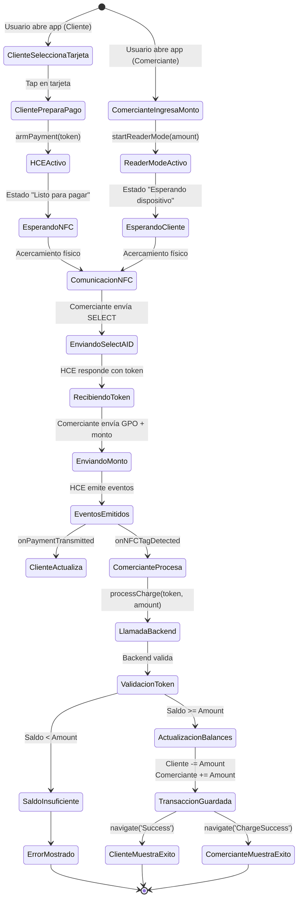
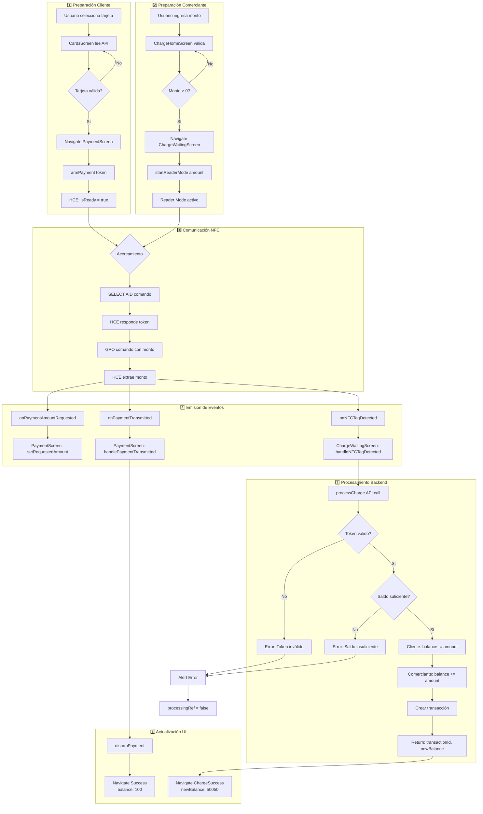

# 🎨 DIAGRAMAS VISUALES - POC NFC

Diagramas visuales y flujos de trabajo del sistema de pagos NFC.

---

## 📱 Interfaz de Usuario - Flujo Completo

### Modo Pagar (Cliente)

```
┌─────────────────────────────────────────────────────────────┐
│                      FLUJO CLIENTE                          │
└─────────────────────────────────────────────────────────────┘

┌─────────────────┐      ┌─────────────────┐      ┌─────────────────┐
│  CardsScreen    │      │ PaymentScreen   │      │ SuccessScreen   │
│                 │      │                 │      │                 │
│  💳 Débito      │      │   💳 •••• 0366  │      │   ✅ Éxito     │
│  Balance: $150  │─────▶│                 │─────▶│                 │
│                 │      │  Monto: $50.00  │      │  Pagado: $50.00 │
│  💳 Crédito     │      │                 │      │  Nuevo: $100.00 │
│  Balance: $85   │      │  ┌───────────┐  │      │                 │
│                 │      │  │ [Preparar]│  │      │  ID: txn_12345  │
│  [Seleccionar]  │      │  └───────────┘  │      │                 │
│                 │      │                 │      │  [Finalizar]    │
└─────────────────┘      │  📡 Acerca tu   │      └─────────────────┘
                         │  dispositivo    │
                         └─────────────────┘
```

### Modo Cobrar (Comerciante)

```
┌─────────────────────────────────────────────────────────────┐
│                   FLUJO COMERCIANTE                         │
└─────────────────────────────────────────────────────────────┘

┌──────────────┐   ┌──────────────┐   ┌──────────────┐   ┌──────────────┐
│  Account     │   │ChargeHome    │   │ChargeWaiting │   │ChargeSuccess │
│  Selection   │   │              │   │              │   │              │
│              │   │              │   │              │   │  ✅ Cobrado  │
│ 🏦 Ahorros   │   │  Ingresar    │   │              │   │              │
│ $50,000.00   │──▶│  monto:      │──▶│  Esperando   │──▶│ Monto: $50   │
│              │   │              │   │  dispositivo │   │              │
│ 🏦 Corriente │   │  $ [50.00]   │   │  NFC...      │   │ Nuevo saldo: │
│ $125,000.00  │   │              │   │              │   │ $50,050.00   │
│              │   │  [Continuar] │   │  📡📡📡     │   │              │
│ [Seleccionar]│   │              │   │              │   │ [Finalizar]  │
└──────────────┘   └──────────────┘   │  [Cancelar]  │   └──────────────┘
                                       └──────────────┘
```

---

## 🔄 Ciclo de Vida de una Transacción



---

## 🧩 Componentes y sus Responsabilidades

### Diagrama de Responsabilidades

```
┌────────────────────────────────────────────────────────────────┐
│                        PRESENTACIÓN                            │
├────────────────────────────────────────────────────────────────┤
│                                                                │
│  ┌──────────────────┐          ┌──────────────────┐          │
│  │  CardsScreen     │          │ ChargeWaiting    │          │
│  ├──────────────────┤          ├──────────────────┤          │
│  │ ✓ Muestra lista  │          │ ✓ Inicia Reader  │          │
│  │ ✓ Selección UI   │          │ ✓ Lee token NFC  │          │
│  │ ✗ NO valida      │          │ ✓ Llama backend  │          │
│  │ ✗ NO procesa     │          │ ✓ Maneja errores │          │
│  └──────────────────┘          └──────────────────┘          │
│                                                                │
│  ┌──────────────────┐          ┌──────────────────┐          │
│  │ PaymentScreen    │          │ ChargeSuccess    │          │
│  ├──────────────────┤          ├──────────────────┤          │
│  │ ✓ Activa HCE     │          │ ✓ Muestra result │          │
│  │ ✓ Escucha eventos│          │ ✗ NO llama API   │          │
│  │ ✗ NO llama API   │          │ ✗ NO procesa     │          │
│  │ ✓ Navega Success │          │ ✓ Solo display   │          │
│  └──────────────────┘          └──────────────────┘          │
│                                                                │
└────────────────────────────────────────────────────────────────┘

┌────────────────────────────────────────────────────────────────┐
│                       LÓGICA DE NEGOCIO                        │
├────────────────────────────────────────────────────────────────┤
│                                                                │
│  ┌──────────────────┐          ┌──────────────────┐          │
│  │   NFCService     │          │   APIService     │          │
│  ├──────────────────┤          ├──────────────────┤          │
│  │ ✓ Bridge nativo  │          │ ✓ HTTP client    │          │
│  │ ✓ Event emitter  │          │ ✓ Timeouts       │          │
│  │ ✓ Error handling │          │ ✓ JSON parsing   │          │
│  │ ✓ Type safety    │          │ ✓ Error handling │          │
│  └──────────────────┘          └──────────────────┘          │
│                                                                │
└────────────────────────────────────────────────────────────────┘

┌────────────────────────────────────────────────────────────────┐
│                      CAPA NATIVA (Java)                        │
├────────────────────────────────────────────────────────────────┤
│                                                                │
│  ┌─────────────────────────┐   ┌─────────────────────────┐   │
│  │ NFCHostApduService ⭐   │   │      NFCModule          │   │
│  ├─────────────────────────┤   ├─────────────────────────┤   │
│  │ ✓ Procesa APDU SELECT   │   │ ✓ armPayment()          │   │
│  │ ✓ Procesa APDU GPO      │   │ ✓ startReaderMode()     │   │
│  │ ✓ Extrae monto          │   │ ✓ IsoDep communication  │   │
│  │ ✓ Emite eventos RN      │   │ ✓ Tag discovery         │   │
│  │ ✓ Maneja token          │   │ ✓ Event emission        │   │
│  └─────────────────────────┘   └─────────────────────────┘   │
│                                                                │
└────────────────────────────────────────────────────────────────┘

┌────────────────────────────────────────────────────────────────┐
│                         BACKEND                                │
├────────────────────────────────────────────────────────────────┤
│                                                                │
│  ┌────────────────────────────────────────────────────────┐   │
│  │              Express Server                            │   │
│  ├────────────────────────────────────────────────────────┤   │
│  │ ✓ Validación de tokens                                 │   │
│  │ ✓ Validación de saldos                                 │   │
│  │ ✓ Actualización de balances (Cliente + Comerciante)    │   │
│  │ ✓ Creación de transacciones                            │   │
│  │ ✓ Manejo de errores                                    │   │
│  │ ✓ CORS configuration                                   │   │
│  └────────────────────────────────────────────────────────┘   │
│                                                                │
└────────────────────────────────────────────────────────────────┘
```

---

## ⚡ Flujo de Datos: Pago Completo



---

## 🔍 Detalle: Protocolo APDU (Bytes)

### Comando SELECT AID

```
┌──────────────────────────────────────────────────────────┐
│              APDU SELECT AID (Bytes)                     │
├──────────────────────────────────────────────────────────┤
│                                                          │
│  ENVIADO POR: Comerciante (Reader Mode)                 │
│  RECIBIDO POR: Cliente (HCE Service)                     │
│                                                          │
│  ┌─────┬─────┬─────┬─────┬─────┬─────────────┬─────┐   │
│  │ 00  │ A4  │ 04  │ 00  │ 07  │ F0 01 02 03 │ 00  │   │
│  │     │     │     │     │     │ 04 05 06    │     │   │
│  └─────┴─────┴─────┴─────┴─────┴─────────────┴─────┘   │
│    │     │     │     │     │          │          │      │
│    │     │     │     │     │          │          │      │
│    │     │     │     │     │          │          └─ Le  │
│    │     │     │     │     │          └─ AID (7 bytes) │
│    │     │     │     │     └─ Lc (longitud)            │
│    │     │     │     └─ P2                             │
│    │     │     └─ P1                                   │
│    │     └─ INS (SELECT)                               │
│    └─ CLA (ISO)                                        │
│                                                          │
│  RESPUESTA:                                              │
│  ┌──────────────────────┬─────┬─────┐                   │
│  │ 31 32 33 34 35 36 37 │ 90  │ 00  │                   │
│  │ 38 39 30 31 32 33 34 │     │     │                   │
│  │ 35 36                │     │     │                   │
│  └──────────────────────┴─────┴─────┘                   │
│     │                      │     │                       │
│     │                      │     └─ SW2 (OK)            │
│     │                      └─ SW1 (Success)             │
│     └─ TOKEN ASCII (1234567890123456)                   │
│                                                          │
└──────────────────────────────────────────────────────────┘
```

### Comando GET PROCESSING OPTIONS

```
┌──────────────────────────────────────────────────────────┐
│        APDU GET PROCESSING OPTIONS (Bytes)               │
├──────────────────────────────────────────────────────────┤
│                                                          │
│  ENVIADO POR: Comerciante (Reader Mode)                 │
│  RECIBIDO POR: Cliente (HCE Service)                     │
│                                                          │
│  ┌─────┬─────┬─────┬─────┬─────┬─────────────┬─────┐   │
│  │ 80  │ A8  │ 00  │ 00  │ 04  │ 00 00 13 88 │ 00  │   │
│  └─────┴─────┴─────┴─────┴─────┴─────────────┴─────┘   │
│    │     │                         │             │      │
│    │     │                         │             └─ Le  │
│    │     │                         │                    │
│    │     │                         └─ MONTO (4 bytes)  │
│    │     │                            Big Endian       │
│    │     │                            0x00001388 =     │
│    │     │                            5000 centavos =  │
│    │     │                            50.00 Bs         │
│    │     │                                             │
│    │     └─ INS (GPO)                                  │
│    └─ CLA (Proprietary)                                │
│                                                          │
│  PROCESAMIENTO EN HCE:                                   │
│  ┌────────────────────────────────────────────┐         │
│  │ int amountCents = ((commandApdu[5] & 0xFF) << 24) │  │
│  │                 | ((commandApdu[6] & 0xFF) << 16) │  │
│  │                 | ((commandApdu[7] & 0xFF) << 8)  │  │
│  │                 |  (commandApdu[8] & 0xFF);       │  │
│  │                                                    │  │
│  │ double amount = amountCents / 100.0;              │  │
│  │ // amount = 50.00                                 │  │
│  └────────────────────────────────────────────┘         │
│                                                          │
│  RESPUESTA:                                              │
│  ┌─────┬─────┐                                           │
│  │ 90  │ 00  │                                           │
│  └─────┴─────┘                                           │
│     │     │                                              │
│     │     └─ OK                                          │
│     └─ Success                                           │
│                                                          │
└──────────────────────────────────────────────────────────┘
```

---

## 🎬 Timeline: Transacción Completa

```
┌─────────────────────────────────────────────────────────────────────┐
│                    TIMELINE DE TRANSACCIÓN                          │
└─────────────────────────────────────────────────────────────────────┘

T = 0ms
│  👤 Cliente selecciona tarjeta
│  📱 CardsScreen carga desde API
│
T = 500ms
│  ✅ Tarjetas cargadas
│  👆 Usuario tap en tarjeta
│
T = 550ms
│  📱 Navigate → PaymentScreen
│  🔧 armPayment(token)
│
T = 650ms
│  ✅ HCE armado (isReady = true)
│  💬 Alert "Listo para pagar"
│
T = 1s
│  👤 Comerciante ingresa monto: $50
│  📱 ChargeWaitingScreen
│  🔧 startReaderMode(50.00)
│
T = 1.2s
│  ✅ Reader Mode activo
│  💬 "Esperando dispositivo..."
│
T = 3s
│  🤝 Usuario acerca dispositivos
│  📡 NFC detectado
│
T = 3.05s
│  📤 SELECT AID → F0010203040506
│
T = 3.10s
│  📥 HCE responde: 1234567890123456 + 9000
│
T = 3.15s
│  📤 GPO + monto (00 00 13 88)
│
T = 3.20s
│  📥 HCE responde: 9000
│  🔔 Emit: onPaymentAmountRequested(50.00)
│  🔔 Emit: onPaymentTransmitted(token, 50.00)
│  🔔 Emit: onNFCTagDetected(token)
│
T = 3.25s
│  📱 PaymentScreen: setRequestedAmount(50.00)
│  📱 ChargeWaitingScreen: processCharge()
│
T = 3.30s
│  🌐 POST /charge-payment
│  {token: "1234567890123456", amount: 50, merchantId: "m1"}
│
T = 3.80s
│  ✅ Backend responde
│  {success: true, transactionId: "txn_123", newBalance: 50050}
│
T = 3.85s
│  🔧 PaymentScreen: disarmPayment()
│  🔧 ChargeWaitingScreen: stopReaderMode()
│
T = 3.90s
│  📱 Navigate → Success (Cliente)
│  📱 Navigate → ChargeSuccess (Comerciante)
│
T = 4s
│  ✅ TRANSACCIÓN COMPLETADA
│  Cliente: $150 - $50 = $100
│  Comerciante: $50,000 + $50 = $50,050
│
└─────────────────────────────────────────────────────────────────────┘

TOTAL: ~4 segundos (incluyendo tiempo de usuario)
COMUNICACIÓN NFC: ~200ms (3s - 3.2s)
BACKEND: ~500ms (3.3s - 3.8s)
```

---

## 🔐 Matriz de Seguridad

### Comparación POC vs Producción

```
┌──────────────────────────────────────────────────────────────┐
│               ANÁLISIS DE SEGURIDAD                          │
├──────────────────────────────────────────────────────────────┤
│                                                              │
│  COMPONENTE         │  POC ACTUAL    │  PRODUCCIÓN          │
│  ───────────────────┼────────────────┼─────────────────────│
│  Token              │  ❌ Estático   │  ✅ EMV Dynamic      │
│  AID                │  ⚠️ Privado    │  ✅ Registrado EMV  │
│  NFC Encryption     │  ❌ Sin cifrar │  ✅ TLS 1.3         │
│  Backend Auth       │  ❌ Ninguna    │  ✅ OAuth 2.0 + JWT │
│  Database           │  ❌ In-memory  │  ✅ PostgreSQL      │
│  Input Validation   │  ⚠️ Básica     │  ✅ Schema strict   │
│  Rate Limiting      │  ❌ No         │  ✅ express-limit   │
│  HTTPS              │  ⚠️ Opcional   │  ✅ Obligatorio     │
│  Logging            │  ⚠️ Console    │  ✅ Winston + S3    │
│  PCI-DSS            │  ❌ No         │  ✅ Level 1 cert    │
│  Penetration Test   │  ❌ No         │  ✅ Anual           │
│                                                              │
│  RIESGO GLOBAL      │  🔴 ALTO       │  🟢 BAJO            │
│                                                              │
└──────────────────────────────────────────────────────────────┘
```

---

## 📊 Métricas de Rendimiento

### Benchmarks Esperados

```
┌─────────────────────────────────────────────────────────────┐
│                 MÉTRICAS DE RENDIMIENTO                     │
├─────────────────────────────────────────────────────────────┤
│                                                             │
│  OPERACIÓN                        │ LATENCIA    │ ÉXITO   │
│  ─────────────────────────────────┼─────────────┼─────────│
│  GET /card-token                  │  ~100ms     │  99.9%  │
│  POST /authorize-payment          │  ~300ms     │  99.5%  │
│  POST /charge-payment             │  ~400ms     │  99.0%  │
│  NFC SELECT AID (roundtrip)       │  ~50ms      │  98.0%  │
│  NFC GPO (roundtrip)              │  ~50ms      │  98.0%  │
│  Reader Mode detection            │  ~200-500ms │  95.0%  │
│  HCE arm/disarm                   │  ~100ms     │  99.9%  │
│                                                             │
│  TRANSACCIÓN COMPLETA (E2E)       │  ~1-2s      │  95.0%  │
│                                                             │
└─────────────────────────────────────────────────────────────┘

NOTAS:
- Latencias medidas en red 4G/WiFi estable
- Tasa de éxito NFC depende de:
  * Distancia entre dispositivos
  * Orientación de antenas
  * Interferencia electromagnética
- Backend en Vercel (cold start puede agregar +1s)
```

---

**Documento creado**: 2026-02-02  
**Versión**: 1.0.0  
**Autor**: Equipo GanaMóvil
