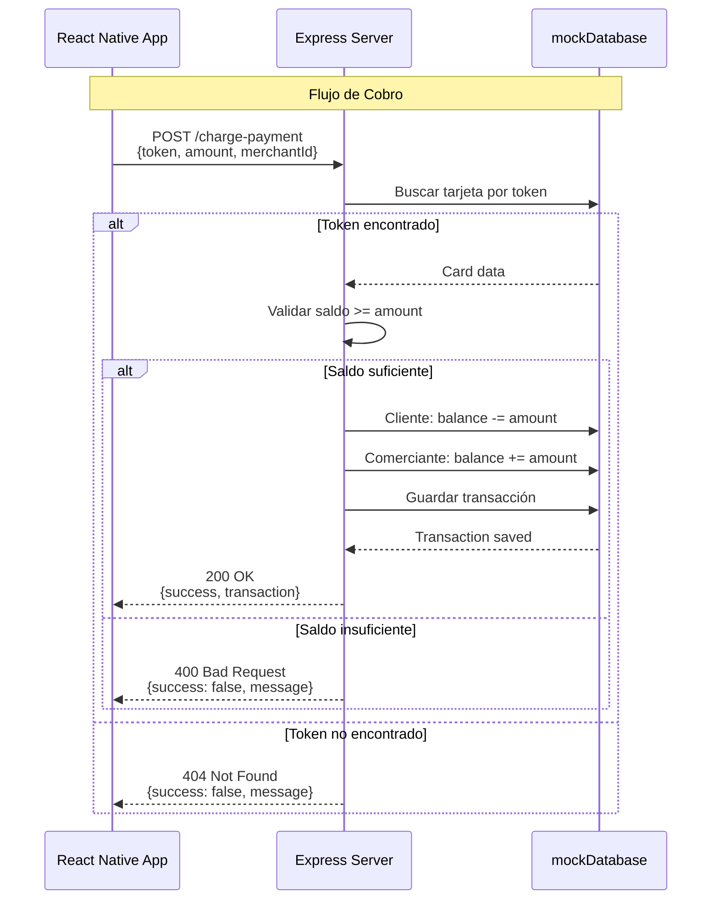

# 🔧 Backend Mock - POC NFC GanaMóvil

API REST Mock para simular funcionalidad de Core Bancario en pruebas de pago NFC.

## 📋 Descripción

Backend minimalista construido con **Express.js** que simula:
- Gestión de tarjetas de débito/crédito
- Procesamiento de pagos NFC (cliente)
- Procesamiento de cobros NFC (comerciante)
- Actualización de balances en tiempo real
- Historial de transacciones

**⚠️ IMPORTANTE**: Este es un servidor MOCK para desarrollo. NO usar en producción.

---

## 🚀 Inicio Rápido

### Instalación y Ejecución

```bash
# Instalar dependencias
npm install

# Iniciar servidor
npm start

# Servidor con auto-reload (desarrollo)
npm run dev
```

El servidor estará disponible en: `http://localhost:3000`

### Despliegue en la Nube (Vercel)

El backend está desplegado en:
```
https://backend-nfc.vercel.app/
```

Para desplegar tu propia versión:
```bash
npm install -g vercel
vercel --prod
```

---

## 📡 API Endpoints

### Base URL

**Local**: `http://localhost:3000`  
**Producción**: `https://backend-nfc.vercel.app`

---

### 🔹 Modo Pagar (Cliente - HCE)

#### **GET** `/card-token` - Obtener todas las tarjetas

Lista todas las tarjetas disponibles del cliente.

**Request:**
```http
GET /card-token
```

**Response:**
```json
{
  "success": true,
  "cards": [
    {
      "id": "1",
      "cardNumber": "4532 0151 1283 0366",
      "lastFourDigits": "0366",
      "token": "1234567890123456",
      "balance": 15000.00,
      "cardHolder": "Juan Pérez",
      "expiryDate": "12/28",
      "cardType": "Débito"
    },
    {
      "id": "2",
      "cardNumber": "5425 2334 3010 9903",
      "lastFourDigits": "9903",
      "token": "6543210987654321",
      "balance": 8500.50,
      "cardHolder": "Juan Pérez",
      "expiryDate": "06/27",
      "cardType": "Crédito"
    }
  ]
}
```

---

#### **GET** `/card-token/:cardId` - Obtener token de tarjeta específica

Devuelve el token y balance de una tarjeta.

**Request:**
```http
GET /card-token/1
```

**Response:**
```json
{
  "success": true,
  "token": "1234567890123456",
  "balance": 15000.00
}
```

**Error (tarjeta no encontrada):**
```json
{
  "success": false,
  "message": "Tarjeta no encontrada"
}
```

---

#### **POST** `/authorize-payment` - Autorizar pago (cliente)

Procesa un pago desde el cliente. Reduce el balance de la tarjeta.

**Request:**
```http
POST /authorize-payment
Content-Type: application/json

{
  "token": "1234567890123456",
  "amount": 150.50,
  "description": "Pago en comercio"
}
```

**Response (éxito):**
```json
{
  "success": true,
  "message": "Pago autorizado",
  "transaction": {
    "id": "txn_1738493856789",
    "amount": 150.50,
    "newBalance": 14849.50,
    "timestamp": "2026-02-02T10:30:56.789Z"
  }
}
```

**Error (saldo insuficiente):**
```json
{
  "success": false,
  "message": "Saldo insuficiente"
}
```

**Error (token inválido):**
```json
{
  "success": false,
  "message": "Token inválido"
}
```

---

#### **GET** `/balance/:token` - Consultar saldo

Obtiene el saldo actual de una tarjeta por su token.

**Request:**
```http
GET /balance/1234567890123456
```

**Response:**
```json
{
  "success": true,
  "balance": 15000.00
}
```

---

### 🔸 Modo Cobrar (Comerciante - Reader Mode)

#### **GET** `/merchant-accounts` - Obtener cuentas de comerciante

Lista todas las cuentas donde el comerciante puede recibir pagos.

**Request:**
```http
GET /merchant-accounts
```

**Response:**
```json
{
  "success": true,
  "accounts": [
    {
      "id": "m1",
      "accountNumber": "1234567890",
      "accountType": "Ahorros",
      "balance": 50000.00,
      "accountHolder": "Comercio GanaMóvil",
      "bankName": "Banco GanaMóvil"
    },
    {
      "id": "m2",
      "accountNumber": "0987654321",
      "accountType": "Corriente",
      "balance": 125000.00,
      "accountHolder": "Comercio GanaMóvil",
      "bankName": "Banco GanaMóvil"
    },
    {
      "id": "m3",
      "accountNumber": "5555666677",
      "accountType": "Nómina",
      "balance": 35000.00,
      "accountHolder": "Comercio GanaMóvil",
      "bankName": "Banco Popular"
    }
  ]
}
```

---

#### **POST** `/charge-payment` - Procesar cobro (comerciante)

Procesa un cobro desde el dispositivo comerciante. Transfiere dinero del cliente al comerciante.

**Request:**
```http
POST /charge-payment
Content-Type: application/json

{
  "token": "1234567890123456",
  "amount": 150.50,
  "merchantAccountId": "m1"
}
```

**Response (éxito):**
```json
{
  "success": true,
  "message": "Cobro procesado exitosamente",
  "transaction": {
    "id": "txn_1738493856789",
    "amount": 150.50,
    "timestamp": "2026-02-02T10:30:56.789Z",
    "clientId": "1",
    "merchantId": "m1",
    "clientNewBalance": 14849.50,
    "merchantNewBalance": 50150.50
  }
}
```

**Error (saldo insuficiente):**
```json
{
  "success": false,
  "message": "Saldo insuficiente en la tarjeta del cliente"
}
```

**Error (token inválido):**
```json
{
  "success": false,
  "message": "Token de pago inválido"
}
```

**Error (cuenta comerciante no encontrada):**
```json
{
  "success": false,
  "message": "Cuenta de comerciante no encontrada"
}
```

---

### 📊 Otros Endpoints

#### **GET** `/transactions` - Historial de transacciones

Obtiene todas las transacciones procesadas.

**Request:**
```http
GET /transactions
```

**Response:**
```json
{
  "success": true,
  "transactions": [
    {
      "id": "txn_1738493856789",
      "type": "charge",
      "amount": 150.50,
      "clientId": "1",
      "merchantId": "m1",
      "timestamp": "2026-02-02T10:30:56.789Z",
      "status": "completed"
    }
  ]
}
```

---

## 💾 Base de Datos (In-Memory)

### Estructura de Datos

```javascript
const mockDatabase = {
  cards: [
    {
      id: '1',
      cardNumber: '4532015112830366',
      token: '1234567890123456',
      balance: 15000.00,
      cardHolder: 'Juan Pérez',
      expiryDate: '12/28',
      cardType: 'Débito'
    },
    {
      id: '2',
      cardNumber: '5425233430109903',
      token: '6543210987654321',
      balance: 8500.50,
      cardHolder: 'Juan Pérez',
      expiryDate: '06/27',
      cardType: 'Crédito'
    }
  ],
  
  merchantAccounts: [
    {
      id: 'm1',
      accountNumber: '1234567890',
      accountType: 'Ahorros',
      balance: 50000.00,
      accountHolder: 'Comercio GanaMóvil',
      bankName: 'Banco GanaMóvil'
    },
    // ...
  ],
  
  transactions: []
};
```

### ⚠️ Persistencia

Los datos están almacenados **en memoria**. Cuando reinicias el servidor:
- ✅ Los saldos vuelven a sus valores iniciales
- ❌ Se pierden todas las transacciones

Para producción, reemplazar con base de datos real (PostgreSQL, MongoDB, etc.).

---

## 🔧 Configuración

### Variables de Entorno

Crear archivo `.env`:

```env
PORT=3000
NODE_ENV=development
ALLOWED_ORIGINS=http://localhost:*
```

### CORS

El backend acepta requests desde cualquier origen en desarrollo. Para producción:

```javascript
app.use(cors({
  origin: 'https://tu-dominio.com',
  credentials: true
}));
```

---

## 🧪 Testing

### Pruebas con cURL

**Obtener tarjetas:**
```bash
curl http://localhost:3000/card-token
```

**Procesar pago:**
```bash
curl -X POST http://localhost:3000/authorize-payment \
  -H "Content-Type: application/json" \
  -d '{
    "token": "1234567890123456",
    "amount": 50.00,
    "description": "Test payment"
  }'
```

**Procesar cobro:**
```bash
curl -X POST http://localhost:3000/charge-payment \
  -H "Content-Type: application/json" \
  -d '{
    "token": "1234567890123456",
    "amount": 50.00,
    "merchantAccountId": "m1"
  }'
```

### Pruebas con Postman

Importar colección: [POC_NFC.postman_collection.json](./POC_NFC.postman_collection.json)

---

## 📊 Diagrama de Flujo Backend



---

## 🔐 Seguridad

### ⚠️ Limitaciones del Mock

- ❌ Sin autenticación (OAuth, JWT)
- ❌ Sin validación de IP/origen
- ❌ Sin rate limiting
- ❌ Sin encriptación de datos
- ❌ Tokens estáticos (no rotan)
- ❌ Sin logs de auditoría

### ✅ Para Producción

```javascript
// Agregar:
- express-rate-limit (rate limiting)
- helmet (security headers)
- bcrypt (password hashing)
- jsonwebtoken (JWT tokens)
- winston (logging)
- express-validator (input validation)
```

---

## 📝 Logs

El servidor loguea todas las transacciones en consola:

```
[2026-02-02 10:30:56] POST /charge-payment
  Token: 1234567890123456
  Amount: 150.50
  Merchant: m1
  Status: SUCCESS
  Client Balance: 15000.00 → 14849.50
  Merchant Balance: 50000.00 → 50150.50
```

---

## 🛠️ Stack Tecnológico

| Componente | Tecnología | Versión |
|------------|------------|---------|
| **Runtime** | Node.js | 20+ |
| **Framework** | Express | 4.x |
| **Middleware** | CORS | 2.x |
| **Deployment** | Vercel | - |

---

## 📚 Referencias

- [Express.js Docs](https://expressjs.com/)
- [Vercel Deployment](https://vercel.com/docs)
- [REST API Best Practices](https://restfulapi.net/)

---

## 🆘 Troubleshooting

### Puerto 3000 ya en uso

```bash
# Linux/Mac
lsof -ti:3000 | xargs kill -9

# Windows
netstat -ano | findstr :3000
taskkill /PID <PID> /F
```

### CORS Error

Verificar que `APIService.ts` apunte a la URL correcta:
```typescript
const API_BASE_URL = 'http://localhost:3000'; // o tu URL de Vercel
```

### "Cannot POST /charge-payment"

Verificar que el `Content-Type` sea `application/json`:
```bash
curl -H "Content-Type: application/json" ...
```

---

**Documento creado**: 2026-02-02  
**Versión**: 1.0.0  
**Autor**: Equipo GanaMóvil
